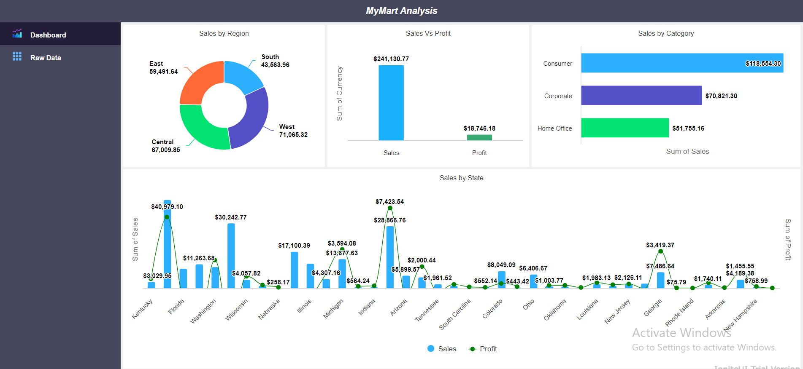

# Data Analysis and Visualization Dashboard

## Overview

This is an open-source dashboard web application designed for data analysis and visualization. It reads data from Excel files and visualizes it using various charts and data tables.

## Features

- **Excel Data Integration**: Uses `xlsx.full.min.js` to read data from Excel files.
- **Interactive Charts**: Utilizes Highcharts for creating interactive and dynamic charts.
- **Advanced Data Tables**: Employs IG Grid Ignite UI for powerful and flexible data tables.

## Getting Started

### Prerequisites

To run this project, you will need a modern web browser and a local server setup (like IIS Manager). You can use tools like [Live Server](https://marketplace.visualstudio.com/items?itemName=ritwickdey.LiveServer) for Visual Studio Code or [http-server](https://www.npmjs.com/package/http-server) for Node.js.

### Installation

1. **Clone the repository**
    ```sh
    git clone https://github.com/JayaKumar-pypro/WebDashboards.git
    cd WebDashboards
    ```

2. **Open in your preferred code editor**

3. **Start a local server** (e.g., using Live Server in VSCode or http-server)
    ```sh
    http-server .
    ```

4. **Open your browser** and navigate to `http://localhost:8080` (or the port specified by your local server).

### Usage

1. **Choose Excel File**
   - Change the Excel file path in JS file you want to visualize.
   - You may change the Excel columns for respective file or use the alais name from existing demo file.

2. **Interact with Charts and Tables**
   - View and interact with various charts generated by Highcharts.
   - Explore data in advanced tables powered by IG Grid Ignite UI.

### Example

Here’s a screenshot of the application in action:



## Contributing

We welcome contributions from the community. Please follow these steps to contribute:

1. **Fork the repository**
2. **Create a new branch** (`git checkout -b feature/YourFeature`)
3. **Commit your changes** (`git commit -m 'Add some feature'`)
4. **Push to the branch** (`git push origin feature/YourFeature`)
5. **Open a pull request**

## License

This project is licensed under the [Jayakumar_PyPro] - see the [LICENSE](LICENSE) file for details.

*Note: This software is licensed for non-commercial use only.*

## Acknowledgements

- [xlsx.full.min.js](https://cdnjs.cloudflare.com/ajax/libs/xlsx/0.16.9/xlsx.full.min.js")
- [Highcharts](https://www.highcharts.com/)
- [IG Grid Ignite UI](https://www.infragistics.com/products/ignite-ui)

## Contact

For any queries or issues, please open an issue on GitHub.
